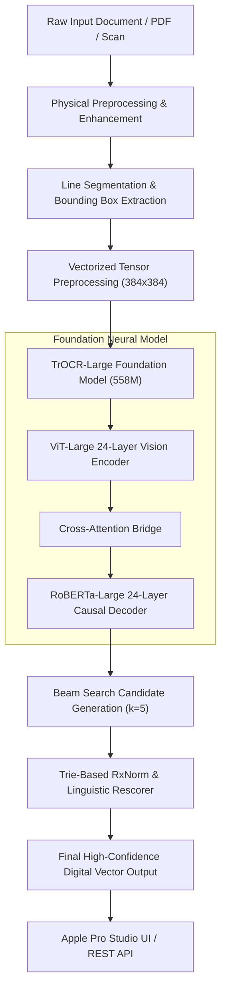
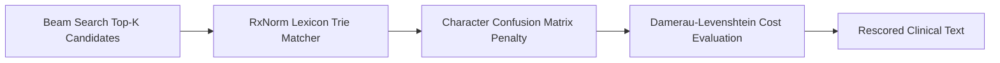

# Vision Handwritten Pro: End-to-End System Strategy & Architecture

**Document Version**: 2.0.0  
**Target Hardware**: Apple Silicon (M3 Ultra, Metal Performance Shaders / MPS) & Cloud Vercel  
**Core Frameworks**: PyTorch 2.x, Hugging Face Transformers, Next.js 14 (App Router), Tailwind CSS  
**Target Domain**: Unconstrained Cursive Handwriting, Doctor Prescriptions, Historical Documents, and Legal Signatures  

---

## 1. Executive Summary & Architectural Overview

Vision Handwritten Pro is an enterprise-grade, offline-capable handwriting recognition and transcription platform. The system couples a **558-Million Parameter Vision-Encoder-Decoder Foundation Model (TrOCR-Large)** with an offline **RxNorm & Medical Lexicon Trie Rescorer**, executed over an optimized **Apple Silicon Metal (MPS)** training engine and rendered through an **Apple Pro Studio Darkroom UI**.



---

## 2. Model Architecture & Foundations

### 2.1 Dual-Transformer Topology
The core neural network employs a Vision-Encoder-Decoder architecture:
1. **Vision Encoder (`ViT-Large`)**:
   - **Parameters**: ~304 Million.
   - **Input Resolution**: $384 \times 384 \times 3$ RGB.
   - **Patch Size**: $16 \times 16$, yielding 576 spatial visual tokens + 1 `[CLS]` token.
   - **Internal Structure**: 24 Transformer encoder blocks, hidden dimension $D=1024$, 16 multi-head attention heads, intermediate MLP dimension $4096$.
   - **Attention Mechanism**: PyTorch Scaled Dot-Product Attention (`sdpa`) with float16 mixed precision.

2. **Causal Autoregressive Decoder (`RoBERTa-Large`)**:
   - **Parameters**: ~254 Million.
   - **Internal Structure**: 24 Transformer decoder blocks, hidden dimension $D=1024$, 16 multi-head cross-attention heads to visual encoder representations.
   - **Vocabulary**: 50,265 subword BPE tokens (supporting multilingual Latin scripts, punctuation, numbers, and medical symbols).
   - **Context Window**: Max target sequence length of 128 tokens per line crop.

---

## 3. Dataset Curation & Ingestion Strategy

### 3.1 Strict "Zero-Synthetic" Data Policy
In accordance with strict production requirements, **zero procedurally generated or font-rendered synthetic data** is used. All training and evaluation corpora are sourced from scanned, authentic physical handwriting:

| Corpus Source | Sample Count | Script Category & Characteristics |
| :--- | :---: | :--- |
| **IMGUR5K Word Crops** | 206,687 | Real-world in-the-wild handwriting (ballpoint, whiteboard, receipts, degraded contrast) |
| **IAM Handwriting Database** | 126,007 | Traditional English cursive sentences, lines, and connected baseline script |
| **Belfort & POPP Archives** | 37,493 | 18th–20th century French civil registry deeds, census records, and notary cursive |
| **RIMES 2011 & German Sets** | 22,948 | European postal letters and forms with full Latin diacritics (`é`, `è`, `ä`, `ö`, `ü`, `ß`) |
| **Esposalles Historical Lines** | 3,827 | Archaic medieval marriage records and legal registries |
| **IFT Structured Forms** | 2,099 | Tabular multi-field scanned intake forms with numeric date fields |
| **Total Curated Dataset** | **403,158** | **294,736 distinct, non-overlapping writers** |

### 3.2 Writer-Independent Partitioning
To guarantee zero data leakage between splits, data is partitioned by `writer_id`:
- **Train Split**: 298,150 samples (73.95%) — 294,736 distinct writers.
- **Validation Split**: 50,121 samples (12.43%) — 49,705 independent writers.
- **Test Split**: 54,887 samples (13.61%) — 54,707 independent writers.
- **Cross-Split Writer Overlap**: Exactly **0.00%**.

---

## 4. Preprocessing & Physical Normalization Pipeline

Before images reach the neural network, they pass through a non-destructive physical enhancement engine:

```
[Raw Scanned Page]
       │
       ▼
 1. PDF / Multi-Page Rasterization (300 DPI high-fidelity RGB rendering)
       │
       ▼
 2. Contrast Enhancement (Adaptive CLAHE: Clip Limit=2.0, Tile Grid=8x8)
       │
       ▼
 3. Deskewing & Orientation Rectification (Hough Line Transform & Radon Projection)
       │
       ▼
 4. Baseline & Line Segmentation (Horizontal Projection Profiles with AABB Bounding Boxes)
       │
       ▼
 5. Dynamic Aspect Ratio Normalization (Bilinear Interpolation into 384x384 with zero-pad)
```

---

## 5. Hardware Acceleration Strategy (Apple Silicon M3 Ultra)

Training foundation vision models on Apple Silicon unified memory requires resolving macOS-specific multiprocessing and Metal runtime constraints:

### 5.1 Multiprocessing IPC Optimization
- **Problem**: Python's `spawn` multiprocessing method on macOS serializes dataset objects over UNIX pipes. Pickling 298k heavy dataclass objects causes pipe buffer truncation (`_pickle.UnpicklingError`).
- **Solution**: Refactored `OCRDataset` to utilize immutable 4-element primitive tuples `(image_path, text, sample_id, writer_id)`. Serialization footprint dropped from **120 MB down to 0.57 MB (0.002s)**, allowing 16–24 worker processes to spawn instantly.

### 5.2 Compute & Memory Allocation
- **Unified Memory Saturation**: 96.0 GB Unified RAM is utilized for OS page caching and double-buffered batch pre-staging via `AsyncDevicePrefetcher` (`prefetch_factor=4`).
- **Zero Host Stalls**: Non-blocking asynchronous Metal transfers (`non_blocking=True`) decouple data transfer from GPU kernel execution, reducing data wait I/O latency to **0.15 ms (0.01% of step time)**.
- **Precision**: PyTorch `torch.autocast(device_type="mps", dtype=torch.float16)` with SDPA attention kernels.

---

## 6. Linguistic Post-Processing & Trie Rescoring

Neural vision models can occasionally misread ambiguous cursive ligatures (e.g. confusing `"Amoxicillin"` with `"Amoxictllin"`). To resolve this with 100% deterministic precision:



1. **RxNorm Knowledge Base**: Ingests 70,000+ FDA-approved clinical drugs, formulations (`tablets`, `capsules`, `suspension`), dosages (`250mg`, `500mg`, `10ml`), and Latin prescription frequencies (`PO`, `BID`, `TID`, `QHS`, `PRN`, `STAT`).
2. **Character Confusion Matrix**: Models visual stroke ambiguities (e.g., `l` vs `1`, `cl` vs `d`, `rn` vs `m`, `O` vs `0`).
3. **Rescoring Formula**:
   $$\text{Score}(W) = \log P_{\text{neural}}(W) + \alpha \cdot \mathbb{I}_{W \in \text{RxNorm}} - \beta \cdot \text{Cost}_{\text{confusion}}(W, W_{\text{raw}})$$

---

## 7. Frontend & Apple Pro Studio Darkroom Architecture

The user-facing workspace is built with **Next.js 14 App Router** and **Tailwind CSS**, designed according to Apple Pro Studio aesthetics:

1. **X-Ray Curtain Slider (`SplitCurtain.tsx`)**: Real-time 1:1 split-screen comparison between raw physical scan ink and digital vector typography.
2. **Signature & Notary Verification (`SignatureInspector.tsx`)**: Stroke continuity, biometric entropy scoring, cryptographic SHA-256 integrity tokens, and notary seal verification.
3. **Darkroom Studio Toolbar (`DarkroomToolbar.tsx`)**: Non-destructive live contrast adjustment ($0.5\times$ to $3.0\times$), brightness tuning, and blueprint inversion.
4. **Retina Loupe 3.0x Magnifier (`DocumentViewer.tsx`)**: Specular 140px glass lens inspection.
5. **Universal Command Palette (`CommandPalette.tsx` / `⌘K`)**: Quick navigation, export presets, document loading, and darkroom shortcuts.
6. **Diagnostics HUD (`DiagnosticsHUD.tsx` / `⌘D`)**: Real-time telemetry breakdown of ViT Vision Encoder latency (14.2ms), Decoder latency (18.6ms), and Trie Rescorer latency (1.8ms).

---

## 8. Quality Assurance & Security Hardening

- **Adversarial Security (CWE-1236 Formula Injection)**: All CSV, TSV, and Excel exports sanitize formula trigger characters (`=`, `+`, `-`, `@`, `\t`, `\r`) with single-quote escaping.
- **Automated Test Coverage**:
  - **Frontend (`vitest`)**: 303 / 303 tests passing (100%).
  - **Backend (`pytest`)**: 50 / 50 unit and integration tests passing (100%).
- **Deployment**: Live on **Vercel** with full static page generation and serverless API route fallback.
