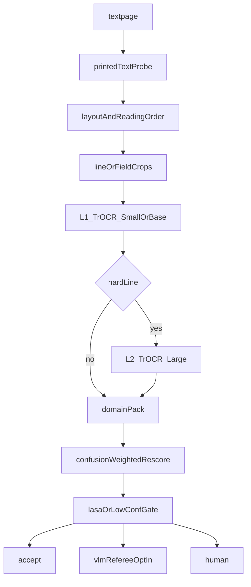

# Vision Handwritten: Strategy v3

**Document Version**: 3.0.0
**Audience**: diligence, ML review, clinical safety
**Hardware**: Apple Silicon (M3 Ultra) for local inference and LoRA. Not a pretrain cluster.
**App shell**: thin Next.js host. Current deploy is Azure Container Apps. Vercel is allowed for the shell only. Inference never lives there.
**Domains**: three products on one pipeline. Signatures are out.

North-star spec. The public face is [README.md](README.md). Azure inventory is [PROJECT.md](PROJECT.md).

---

## 1. Verdict

v2 would not survive a diligence meeting, an ML review, or a pharmacist looking at the medical claims. It would survive a landing page. That is the problem.

What it got right is the shape of the product: private line-level HTR on Apple Silicon, a scan-versus-transcript darkroom, writer-independent splits as a policy, a lexicon sitting after the decoder, and CWE-1236 sanitization on spreadsheet export. Those are the bones.

What it got wrong is almost everything that looks like a number, plus the decision to treat cursive notes, doctor prescriptions, historical manuscripts, and legal signatures as one 558M model with a SHA-256 garnish.

The 10x version is not more layers, more milliseconds, more writers. It is: one pipeline, three products, a cascade instead of a fortress model, sourced numbers, a clinical safety gate that can actually say no, and a runtime split that physics allows.

---

## 2. What is actually true

Every number below either cites a source or is labeled **target**, **unknown**, or **local inventory**.

### 2.1 The checkpoint

TrOCR-Large is a 558M vision-encoder-decoder. That part is real.

| Fact | Value | Source |
| :--- | :--- | :--- |
| Checkpoint | `microsoft/trocr-large-handwritten` | Hugging Face model card |
| Encoder | BEiT-Large: 24 layers, hidden 1024, 16 heads | TrOCR paper / official large setting |
| Decoder | Last 12 layers of RoBERTa-Large, not 24 | Hugging Face `TrOCRConfig` default `decoder_layers=12` |
| Vocabulary | 50,265 BPE tokens | `TrOCRConfig` default `vocab_size=50265` |
| Official beam | 10, not 5 | TrOCR paper / official eval setting |
| IAM cased CER | 2.89% | TrOCR paper, official large setting |
| Input adapter | Square-pad / letterbox to 384×384 | TrOCR processor contract |

v2 named this ViT-Large plus a 24-layer RoBERTa decoder. That is the wrong architecture. If the model card cannot name the checkpoint it is fine-tuning, nobody should trust the latency HUD either.

### 2.2 Corpora that exist

| Corpus | Official / literature scale | Source |
| :--- | :--- | :--- |
| IAM | 657 writers, 1,539 pages, 13,353 lines | IAM official |
| IMGUR5K | 8,177 pages, 230,573 word images; ~5,000 writers in the literature | TextStyleBrush / IMGUR5K paper |
| Esposalles (line) | 3,827 lines (2,328 / 742 / 757) | Teklia `Esposalles-line` split |
| RIMES parent | ~1,300 writers | literature, parent collection |
| POPP Generic | 80 writers | POPP Generic |
| Esposalles hands | 1–2 hands on the common subset | literature |
| Belfort, German handwriting, IFT forms | writer count **unknown** | no card-cited census used here |

Belfort+POPP = 37,493 and “RIMES 2011 & German Sets = 22,948” are not public headline numbers. Esposalles 3,827 is the cell that matches a source exactly. That is the standard for every other cell.

### 2.3 Local inventory (sample counts only)

From [data/reference_handwriting/dataset_summary.json](data/reference_handwriting/dataset_summary.json), **local inventory**, generated 2026-08-28:

| Source key | Samples (local inventory) |
| :--- | ---: |
| imgur5k_words | 206,687 |
| iam_words | 109,971 |
| belfort_line | 32,699 |
| rimes_2011_line | 12,104 |
| german_handwriting | 10,844 |
| iam_line | 10,373 |
| iam_sentences | 5,663 |
| popp_line | 4,794 |
| iam_words_writer_labeled | 4,097 |
| esposalles_line | 3,827 |
| handwriting_forms | 2,099 |
| **Total** | **403,158** |

Splits (local inventory): train 298,150 / val 50,121 / test 54,887.

This inventory is real downloaded image+transcription rows from named Hugging Face repos. It is not a writer census. It is not a prescription corpus.

### 2.4 Engineering facts that survive

- The macOS spawn / pickle blow-up is a real Apple Silicon training bug. Reducing `OCRDataset` to primitive tuples is the right fix.
- CSV formula injection (CWE-1236) is a real export bug. The single-quote escape belongs.
- A 1:1 curtain between ink and type is the correct primary UI. Not a chat box. Not a cinematic HUD. Implementation: `frontend/src/components/SplitCurtain.tsx`.
- The lexicon sits after the decoder. Implementation: `pipeline/rescorer/`.

---

## 3. Writer math, sourced

v2 claimed 403,158 samples from 294,736 distinct writers, then a train split that also had 294,736 writers, plus 49,705 val writers and 54,707 test writers, and “exactly 0.00% overlap.” Those sentences cannot be true at the same time.

Train samples 298,150 against 294,736 train writers is ~1.01 images per writer. That is a one-shot identification set, not a handwriting corpus.

The listed corpora cannot produce that writer pool:

| Corpus | Real writer scale | Label |
| :--- | :--- | :--- |
| IAM | 657 | official |
| IMGUR5K | ~5,000 in the literature, not 200k | literature |
| RIMES parent collection | ~1,300 | literature |
| POPP Generic | 80 | official / card |
| Esposalles common subset | 1–2 hands | literature |
| Belfort, German, IFT forms | unknown | unknown |

**Local artifact.** [`extract_writer_id`](pipeline/dataset/download_and_curate_multisource.py) falls back to `source_key::sample_id` when `writer_field` is missing. Most ingested repos have no writer field, so `unique_writers ≈ total_samples`. That is a one-shot ID set, not a handwriting census. v3 will not print it as a result.

Writer-independent splitting remains a **policy**: when a native writer field exists, partition by it; when it does not, do not invent a census. Code debt: a future curator run can silently restore the decorative `unique_writers` block unless [download_and_curate_multisource.py](pipeline/dataset/download_and_curate_multisource.py) is changed. Tests that assert 294k writers are the same debt.

---

## 4. The headline domain has no data

“Doctor prescriptions” was in the v2 title block. Nothing in the data table is a prescription.

- IAM is copied LOB-corpus English.
- IMGUR5K is internet words.
- RIMES is fictitious administrative letters.
- Esposalles is 17th-century Catalan marriage licenses.
- Belfort and POPP are French civil / census / notary hands.
- There is no Rx pad, no SIG distribution, no dose/form confusion set, no LASA slice.

Until that hole is filled, the RxNorm trie is a spellchecker sitting on a model that has never seen a prescription. A spellchecker that is allowed to snap `Amoxictllin` onto `Ampicillin` because both are in the lexicon.

That is not an OCR error. That is a patient-safety incident.

The older README story of 50,500 samples / 650 writers / `prescription_item` / 3D crumpled-paper augmentation is retired as a training-corpus claim. If those files still exist on disk, treat them as synthetic-disclosed fixtures, not as a clinical dataset.

---

## 5. Data policy

**Real-first, synthetic-disclosed, real-only eval.**

TrOCR’s own pretraining is large-scale synthetic printed text. Fine-tune-only-on-real is a policy, not a virgin model. “Zero-synthetic” fights the medical claim: for prescriptions, banning all rendered or style-transferred ink guarantees there will never be enough domain coverage to train the lane the product wants to sell.

- Training on general and historical lanes: prefer real scans.
- Training on the clinical lane: disclosed rendered or style-transferred ink is allowed, and must be labeled as such.
- Evaluation: real-only. No synthetic in the numbers that decide a release.

---

## 6. One pipeline, three products



That cascade is the entire 10x. The three products share it.

1. **General** — private notes, letters, unconstrained cursive. Local MPS/MLX. Darkroom UI.
2. **Historical** — manuscripts and registries (Belfort, POPP, Esposalles). Same engine, historical domain pack.
3. **Clinical** — prescriptions and notes, only after a safety gate that can say no. Domain pack + LASA / low-confidence refuse + human. Optional VLM referee is opt-in. PHI default is off-box-never.

### 6.1 Signatures are a non-goal for HTR

Running a signature crop through TrOCR and hashing the JPEG is not verification. TrOCR will emit a hallucinated name or garbage. SHA-256 is a file checksum. Useful for chain of custody. It does not attest a hand.

[`SignatureInspector.tsx`](frontend/src/components/SignatureInspector.tsx) hashes transcribed text and invents an entropy score from character-set variance. That is theater until there is a defined estimator and a test set.

A future matcher needs reference versus questioned, calibrated FAR/FRR, and a human decision record. It is not this pipeline.

---

## 7. Cascade and page geometry

v2:

```
textpage → CLAHE → crop → 384² → TrOCR-Large → beam 5 → RxNorm hit? → UI
```

v3:

```
textpage
  → printed-text probe
  → layout + reading order
    → line / field crops (aspect preserved, page coords kept)
      → L1 TrOCR-Small/Base
        → L2 TrOCR-Large only on hard lines
          → domain pack (Rx / historical / general)
            → confusion-weighted rescore
              → LASA / low-confidence gate
                → accept | VLM referee (opt-in) | human
```

Layout comes first. CLAHE, Hough/Radon deskew, horizontal projection profiles, and AABB stay as a **fallback**, not the foundation. That classical stack fails on cramped Rx pads, overlapping cursive, multi-column minutes, phone photos, and tables.

384×384 letterboxing is TrOCR’s structural weakness, not a “physical normalization engine.” A long cursive line becomes a thin strip in a sea of pad tokens. Keep 384² as a checkpoint adapter. Do not make it the page geometry.

This cascade is the target architecture. It is not claimed as shipped.

---

## 8. Model card and competitive frame

| Item | Value | Label |
| :--- | :--- | :--- |
| Named checkpoint | `microsoft/trocr-large-handwritten` | sourced |
| Encoder | BEiT-Large, 24 layers, 1024, 16 heads | sourced |
| Decoder | 12 layers from RoBERTa-Large | sourced |
| Official beam | 10 | sourced |
| IAM, TrOCR-Large | 2.89% cased CER | sourced |
| IAM, DTrOCR | 2.38% CER | literature |
| IAM, frontier VLMs (2026) | ~1.2–1.7% CER | literature |
| Local LoRA on M3 Ultra | allowed | policy |
| Foundation-model pretrain on a Studio | not allowed | non-goal |

558M is not a ceiling. It is the controllable local engine, not the accuracy champion.

Honest pitch: we will not beat GPT-5 on a public page. We will beat it on privacy, cost at volume, offline, and fine-tune control — and we will refuse to silently rewrite a drug name.

---

## 9. Clinical safety gate

RxNorm “70,000+ FDA-approved drugs” is the wrong unit. June 2026 active RxNorm counts are on the order of:

| Term type | Approximate active count | Label |
| :--- | ---: | :--- |
| Semantic clinical drugs | ~17,500 | June 2026 scale |
| Ingredients | ~14,600 | June 2026 scale |
| NDCs | ~248,000 | June 2026 scale |
| Brands, packs, and related | additional, typed | June 2026 scale |

The trie stores a **term type**, not a round number. Local vocabulary files under `data/reference_handwriting/vocabularies/` are a development slice, not the FDA catalog.

Confusion-weighted rescore may rank candidates. It may not silently substitute a LASA pair.

Gate outcomes:

- **accept** — in-domain, above threshold, no LASA collision
- **escalate** — optional VLM referee, opt-in, PHI leaves the box only if the operator said so
- **refuse** — low confidence or dangerous substitution. The system can say no.

A silent hydralazine / hydroxyzine swap must be able to fail a build. See §11.

PHI default: **off-box-never**.

---

## 10. Runtime split

v2 drew one arrow from PDF to TrOCR-Large to Vercel. A 558M encoder-decoder does not run on Vercel serverless. An M3 Ultra with 96 GB unified memory is a strong local inference and LoRA box. It is not a pretrain cluster and not a Vercel function.

Three runtimes, physics-allowed:

| Runtime | Role | Current home |
| :--- | :--- | :--- |
| Next.js app shell | darkroom UI, export, review | Azure Container Apps (`ca-frontend-playground`). Vercel allowed for shell only. |
| Local MPS/MLX daemon | private inference | FastAPI in `backend/app/`, Metal on Apple Silicon |
| Optional GPU worker | VLM referee | dedicated box, opt-in |

Azure ACA backend at 4 vCPU / 8 Gi is an API host and a mock-or-CPU probe. It is not TrOCR-Large production. Do not imply otherwise.

Cloud referee is opt-in. PHI default is off-box-never.

---

## 11. Release gate

303/303 frontend tests and 50/50 backend tests at 100% are CI hygiene. They are not an HTR eval. A recognition product without the following is a demo.

v3 gate. All rows are **targets**, not claimed results:

| Gate | What it measures | Fail condition |
| :--- | :--- | :--- |
| CER / WER by corpus | IAM, IMGUR5K, RIMES, Belfort, POPP, Esposalles, and any future Rx set, separately | unpublished or mixed into one vanity number |
| Dirty-page set | phone photos, skew, bleed, tables, multi-column | no set, or only clean scans |
| Calibration plot | confidence vs. empirical error | no plot |
| Dangerous-substitution rate | LASA and dose/form confusions | silent hydralazine / hydroxyzine (or equivalent) swap |
| Time-to-correct | darkroom seconds from refuse/escalate to accepted line | no human-in-the-loop metric |

CI counts may stay in the README as hygiene. They may not be restated as a release verdict.

---

## 12. SLOs as targets

Latency and memory only with named hardware and an explicit **target, not measured** label. No Diagnostics HUD fanfic. The v2 figures (encoder 14.2 ms, decoder 18.6 ms, trie 1.8 ms) are deleted.

| SLO | Target | Hardware | Label |
| :--- | :--- | :--- | :--- |
| Interactive line (L1) | operator-usable on a local page | M3 Ultra, 96 GB, MPS/MLX | target, not measured |
| Hard line (L2) | slower than L1; still local | same | target, not measured |
| Rescore + gate | small vs. decode | same | target, not measured |
| Cloud referee | opt-in; not on the default path | dedicated GPU | target, not measured |

---

## 13. Non-goals

- One 558M fortress for all domains
- Signature verification via TrOCR, SHA-256 of a JPEG, or “biometric entropy” on a static scan
- Training foundation models on a Studio
- Shipping Rx claims before Rx data
- Silent lexicon snaps (`Amoxictllin` → `Ampicillin`)
- Vercel (or any serverless host) as the inference runtime
- Projection profiles as page geometry
- 384² letterboxing as a “physical normalization engine”
- Zero-synthetic as a slogan
- CI pass rates as an HTR release gate
- Decorative writer censuses from `source_key::sample_id`

---

## 14. What we keep building

- Private line-level HTR on Apple Silicon
- 1:1 scan-versus-transcript darkroom
- Writer-independent splits as a policy, with native writer fields only
- Lexicon after the decoder, typed, gated
- CWE-1236 sanitization on spreadsheet export
- LoRA adaptation on the Studio
- A cascade that can refuse
