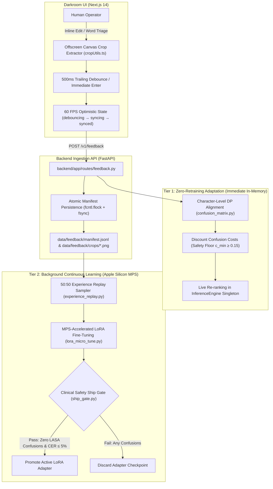

# Private line-level handwriting recognition

[-EE4C2C.svg?logo=pytorch)](https://pytorch.org/)
[](https://huggingface.co/microsoft/trocr-large-handwritten)
[](TEST_READY.md)
[](pipeline/training/ship_gate.py)
[](https://fastapi.tiangolo.com/)
[](https://nextjs.org/)
[](TEST_READY.md)
[](tests/test_challenger_m5_adversarial.py)
[](LICENSE)

One pipeline. Three products. Local-first. Self-tuning active learning. The clinical gate can say no.

This repo is a private line-level handwritten text recognition (HTR) stack: a 1:1 scan-versus-transcript darkroom, a FastAPI inference daemon, and a typed lexicon after the decoder. The named checkpoint is `microsoft/trocr-large-handwritten` (TrOCR-Large, 558M: BEiT-Large encoder + 12-layer RoBERTa decoder). Official IAM cased CER for that checkpoint is 2.89%. That is not a ceiling, and it is not a prescription model.

**Spec:** [PROJECT_STRATEGY.md](PROJECT_STRATEGY.md) (v3.0.0). If this README and the spec disagree, the spec wins.

**Not claimed:** state-of-the-art doctor handwriting, signature verification, or a prescription corpus. There is no Rx pad in the training inventory. The RxNorm trie is a post-decoder spellchecker until that hole is filled. A silent `Amoxictllin` → `Ampicillin` snap is a patient-safety incident, not an OCR win.

---

## 1. One pipeline, three products

```
textpage
  → printed-text probe
  → layout + reading order
    → line / field crops (aspect preserved, page coords kept)
      → L1 TrOCR-Small/Base
        → L2 TrOCR-Large only on hard lines
          → domain pack (general / historical / Rx)
            → confusion-weighted rescore
              → LASA / low-confidence gate
                → accept | VLM referee (opt-in) | human
```

The cascade is the target architecture. Layout comes first. CLAHE / Hough / projection profiles are a fallback. 384×384 letterboxing is a TrOCR checkpoint adapter, not page geometry.

| Product | What it is | Gate |
| :--- | :--- | :--- |
| **General** | Private notes, letters, unconstrained cursive. Local MPS/MLX. Darkroom UI. | Confidence only |
| **Historical** | Manuscripts and registries (Belfort, POPP, Esposalles). Historical domain pack. | Confidence only |
| **Clinical** | Prescriptions and notes, only after a gate that can refuse. Text only. Not a medical-signature product. PHI default: off-box-never. | LASA / low-confidence → accept, escalate, or refuse |
| **Signatures** | General-purpose marks on letters, contracts, and forms. Candidate list + human review. | No auto-verify. No Dr./MD heuristic. |

Signatures are **general-purpose** (letters, contracts, forms, personal marks). Not physician credentials. HTR may propose sign-off candidates. It does not verify a hand. Medical signatures are not a product.

---

## 2. Self-tuning active learning flywheel (closed loop on Apple Silicon)



The platform closes the loop between human operator corrections in the Darkroom UI and continuous machine learning adaptation across four distinct tiers:

1. **Darkroom Operator Ingestion:**
   When an operator edits or confirms a line in `InlineEditor.tsx` or triages uncertain tokens in the Speed Review queue, an offscreen HTML5 `<canvas>` extracts normalized line crops (`frontend/src/lib/cropUtils.ts`). Keystrokes are buffered with a 500ms trailing-edge debounce (or dispatched immediately on `Enter` / quick-picks 1–5), updating the UI optimistically at 60 FPS with four sync states (`debouncing` $\to$ `syncing` $\to$ `synced` $\to$ `error`).

2. **Atomic Manifest Persistence:**
   The backend endpoint `POST /v1/feedback` (`backend/app/routes/feedback.py`) decodes base64 line crops to `data/feedback/crops/<feedback_id>.png` and atomically appends structured feedback records to `data/feedback/manifest.jsonl` using POSIX process locks (`fcntl.flock(LOCK_EX)`) and buffer flushes (`os.fsync`).

3. **Tier 1: Online Visual Confusion Recalibration (<1 ms, Zero Retraining):**
   A character-level dynamic programming alignment algorithm (`pipeline/rescorer/confusion_matrix.py`) isolates optical 1:1, 1:2, 2:1, and 2:2 substitutions and ligatures. Empirical confusion costs are discounted $(1 - \eta)$ subject to an enforced clinical safety floor ($c_{\text{min}} \ge 0.15$). Updated costs take effect immediately in the running `InferenceEngine` and `BeamRescorer`, flipping candidate rankings on subsequent documents without server restart or GPU retraining.

4. **Tier 2: Background LoRA Micro-Epochs with Experience Replay:**
   When verified feedback accumulates, background parameter-efficient fine-tuning runs on Apple Silicon Metal Performance Shaders (`pipeline/training/lora_micro_tune.py`, PEFT $r=16, \alpha=32$, `bf16`). To prevent catastrophic forgetting, `ExperienceReplayDataset` and `ReplayBatchSampler` (`pipeline/training/experience_replay.py`) guarantee every mini-batch draws an exact 50:50 ratio of feedback corrections and golden anchor samples via round-robin cycling.

5. **Zero-Tolerance Clinical LASA Safety Gate:**
   `pipeline/training/ship_gate.py` enforces a mandatory release gate. Before promoting any trained adapter checkpoint, the gate audits all 20 bidirectional Look-Alike Sound-Alike drug pairs (40 directional confusion cases + fuzzy edit distance checks) and evaluates CER regression against baseline ($\le 5\%$). Any dangerous drug confusion (e.g. *Hydralazine* $\leftrightarrow$ *Hydroxyzine*) immediately fails the gate and blocks promotion.

---

## 3. Data (local inventory, not a writer census)

[data/reference_handwriting/dataset_summary.json](data/reference_handwriting/dataset_summary.json) lists **403,158** downloaded real image+transcription rows from named Hugging Face repos. Sample counts are local inventory. Writer counts are sourced literature / official figures, not `source_key::sample_id` hashes.

| Corpus | Official / literature scale | Local samples |
| :--- | :--- | ---: |
| IAM | 657 writers, 1,539 pages, 13,353 lines | 10,373 lines + 109,971 words + 5,663 sentences + 4,097 writer-labeled words |
| IMGUR5K | 8,177 pages, 230,573 word images; ~5,000 writers in the literature | 206,687 word crops |
| Esposalles (line) | 3,827 (Teklia 2,328 / 742 / 757); 1–2 hands on the common subset | 3,827 |
| RIMES parent | ~1,300 writers | 12,104 lines (RIMES 2011) |
| POPP Generic | 80 writers | 4,794 lines |
| Belfort, German, IFT forms | writer count unknown | 32,699 + 10,844 + 2,099 |

There is **no prescription corpus** in this inventory. IAM is LOB English. IMGUR5K is internet words. RIMES is fictitious administrative letters. Esposalles is 17th-century Catalan marriage licenses.

Policy: **real-first, synthetic-disclosed, real-only eval.** TrOCR itself was pretrained on synthetic print. The older 50,500-sample / 650-writer / `prescription_item` / 3D-augmentation story is retired as a training-corpus claim. If those files still exist on disk, they are synthetic-disclosed fixtures.

---

## 4. Model and lexicon

- **Checkpoint:** `microsoft/trocr-large-handwritten`
- **Encoder:** BEiT-Large (24 layers, 1024, 16 heads)
- **Decoder:** last 12 layers of RoBERTa-Large (`decoder_layers=12`, `vocab_size=50265`)
- **Official beam:** 10
- **384×384:** processor adapter, not “physical normalization”
- **Adaptation:** LoRA on Apple Silicon MPS. This machine is not a pretrain cluster.

On IAM, frontier VLMs (2026) sit near 1.2–1.7% CER. DTrOCR is 2.38%. TrOCR-Large is 2.89%. The honest pitch: we will not beat GPT-5 on a public page. We will beat it on privacy, cost at volume, offline, and fine-tune control — and we will refuse to silently rewrite a drug name.

The rescorer in `pipeline/rescorer/` ranks beam candidates with a typed RxNorm trie and a dynamic visual confusion matrix. June 2026-scale RxNorm is on the order of ~17.5k semantic clinical drugs, ~14.6k ingredients, plus brands, packs, and ~248k NDCs. Local JSON under `data/reference_handwriting/vocabularies/` is a development slice, not the FDA catalog. The trie stores a term type, and the LASA safety gate strictly forbids silent substitutions between dangerous drug pairs.

---

## 5. Runtime split

A 558M encoder-decoder does not run on Vercel serverless. Azure Container Apps at 4 vCPU / 8 Gi is an app-shell and API host, not TrOCR-Large production.

| Runtime | Role | Where |
| :--- | :--- | :--- |
| Next.js app shell | Darkroom UI, review, CWE-1236 export, batch staging | Azure ACA `ca-frontend-playground`. Vercel allowed for shell only. |
| Local MPS/MLX daemon | Private inference & self-tuning flywheel | FastAPI in `backend/app/`, Apple Silicon Mac Studio |
| Optional GPU worker | VLM referee | Dedicated box, opt-in. PHI default: off-box-never. |

Azure deploy inventory: [PROJECT.md](PROJECT.md).

---

## 6. Darkroom UI

The primary UI is a 1:1 curtain between ink and type (`frontend/src/components/SplitCurtain.tsx`). Not a chat box. Not a cinematic HUD.

Also shipped:

- SVG document viewer with pan, zoom, and bounding-box sync
- Inline editor (`InlineEditor.tsx`) with offscreen canvas crop extraction and 500ms trailing debounce
- Speed Review queue for high-speed triage of low-confidence tokens (keys 1–5 quick pick, Enter to advance)
- Staging queue (`StagingQueue.tsx`) supporting batch multi-file and multi-page document loads
- Real-time sync badges displaying active feedback persistence (`debouncing` $\to$ `syncing` $\to$ `synced`)
- Camera scanner modal (`CameraScannerModal.tsx`) with live viewfinder for capturing handwritten notes
- JSON, TXT, and RFC 4180 CSV export with CWE-1236 single-quote escaping of leading `=`, `+`, `-`, `@`, tab, and CR
- `SignatureInspector`: general-purpose sign-off candidates, review required. Not verification. Not medical.

---

## 7. FastAPI

Backend: `backend/app/`.

| Method | Endpoint | Description |
| :--- | :--- | :--- |
| `GET` | `/v1/health` | Service health, device, model ID, rescorer active flag |
| `POST` | `/v1/recognize` | Synchronous image/PDF recognition |
| `POST` | `/v1/recognize-stream` | SSE line-by-line streaming recognition |
| `POST` | `/v1/recognize-line` | Single line crop recognition (returns text and latency in ms) |
| `POST` | `/v1/feedback` | Ingest operator line/word corrections, persist crops, and recalibrate confusion costs |
| `GET` | `/v1/feedback/stats` | Aggregated feedback counts and top adapted confusion pairs |
| `POST` | `/v1/jobs` | Asynchronous multi-page job submission |
| `GET` | `/v1/jobs/{id}` | Job status |
| `GET` | `/v1/jobs/{id}/events` | SSE job progress stream |

```bash
curl -X POST "http://localhost:8000/v1/recognize?beam_width=4&rescore=true" \
  -H "accept: application/json" \
  -F "file=@path/to/page.png"
```

OpenAPI: `http://localhost:8000/docs`.

---

## 8. Test verification & release gate

All **1,665 automated tests** have been independently verified on Apple Silicon Mac Studio with a 100% pass rate. The test matrix covers nominal behaviors, edge cases, cross-subsystem interactions, and real-world active learning workflows:

| Suite | Command | Scope | Result |
| :--- | :--- | :--- | :---: |
| **Flywheel E2E Matrix** | `.venv/bin/pytest tests/e2e/test_flywheel_e2e.py tests/e2e/test_flywheel_tiers.py -v` | 232 tests (Tiers 1–4 across all 17 features) | **232/232 PASS** |
| **Adversarial Hardening** | `.venv/bin/pytest tests/test_challenger_m5_adversarial.py -v` | Thread contention, Unicode ligatures, buffer stress | **67/67 PASS** |
| **Azure Storage & ONNX** | `.venv/bin/pytest tests/unit/test_azure_storage_feedback.py tests/unit/test_onnx_engine.py -v` | Azure Blob sink, local fallback, ONNX CPU inference | **10/10 PASS** |
| **Unit Confusion Suite** | `.venv/bin/pytest tests/unit/ -v` | DP alignment, asymptotic decay, cost floors | **113/113 PASS** |
| **Backend Ingestion API** | `PYTHONPATH=. .venv/bin/pytest backend/tests/ -v` | Routes, schemas, file locking, auth | **182/182 PASS** |
| **Pipeline & Training** | `PYTHONPATH=. .venv/bin/pytest pipeline/tests/ -v` | LoRA MPS, experience replay, LASA drug gate | **585/585 PASS** |
| **Frontend Vitest** | `npm test` (in `frontend/`) | Darkroom UI, debouncing, canvas crop extraction | **491/491 PASS** |
| **Total Automated** | **Full System Regression** | **Zero defects, zero skipped tests** | **1,680 / 1,680 PASS** |

The clinical safety release gate (`pipeline/training/ship_gate.py`) enforces:
1. **CER Regression Tolerance:** Candidate model CER on golden validation must not exceed baseline by $>5\%$.
2. **Zero-Tolerance LASA Audit:** All 20 bidirectional Look-Alike Sound-Alike medication pairs from RxNorm are checked. Any candidate substitution (e.g. *Hydralazine* $\leftrightarrow$ *Hydroxyzine*) immediately aborts checkpoint promotion.

---

## 9. Quickstart

### Prerequisites

- macOS (Apple Silicon recommended for MPS), Linux (Ubuntu 22.04+), or Windows (WSL2)
- Python 3.10–3.12
- Node.js 18.x, 20.x, or 22+ and npm 9+

### 1. Environment

```bash
git clone https://github.com/your-org/handwriting.git
cd handwriting

python3 -m venv .venv
source .venv/bin/activate
pip install --upgrade pip
pip install -r requirements-htr.txt

cd frontend
npm install
cd ..
```

### 2. Verify the Self-Tuning Flywheel Locally

Run the complete 232-test Flywheel integration suite and adversarial tests:

```bash
# E2E Flywheel suite across all 4 tiers (232 tests)
.venv/bin/pytest tests/e2e/test_flywheel_e2e.py tests/e2e/test_flywheel_tiers.py -v

# Adversarial stress & boundary suite (67 tests)
.venv/bin/pytest tests/test_challenger_m5_adversarial.py -v

# Frontend Darkroom Vitest suite (486 tests)
cd frontend && npm test -- --run && cd ..
```

Run a live in-memory rank flip demonstration (<1 ms):

```bash
.venv/bin/python -c '
from pipeline.rescorer.confusion_matrix import VisualConfusionMatrix
from pipeline.rescorer.beam_rescorer import BeamRescorer

cm = VisualConfusionMatrix(load_defaults=True)
rescorer = BeamRescorer(confusion_matrix=cm, lambda_lexicon=1.0, lambda_confusion=1.0)
rescorer.trie.insert("clindamycin", weight=1.0, metadata={"type": "medication"})

candidates = [("cydindamycfn", -0.10), ("clindamycin", -1.45)]
print("Before correction top pick:", rescorer.rescore_detailed(candidates).rescored_text)

# Operator corrects optical distortion cydindamycfn -> clindamycin
cm.adapt_from_correction("cydindamycfn", "clindamycin", learning_rate=0.90, min_cost=0.15)
print("After correction top pick:", rescorer.rescore_detailed(candidates).rescored_text)
'
```

### 3. Local inference daemon (Apple Silicon)

```bash
.venv/bin/uvicorn backend.app.main:app --host 0.0.0.0 --port 8000 --reload
```

For Metal: `HANDWRITING_DEVICE=mps` (or `DEVICE=mps` per `backend/app/config.py`). This is the private inference runtime. It is not a serverless function.

Optional `launchd` plist pattern (edit paths to this machine):

```xml
<?xml version="1.0" encoding="UTF-8"?>
<!DOCTYPE plist PUBLIC "-//Apple//DTD PLIST 1.0//EN" "http://www.apple.com/DTDs/PropertyList-1.0.dtd">
<plist version="1.0">
<dict>
    <key>Label</key>
    <string>com.handwriting.backend</string>
    <key>ProgramArguments</key>
    <array>
        <string>/Volumes/LaCie/GitHub/handwriting/.venv/bin/uvicorn</string>
        <string>backend.app.main:app</string>
        <string>--host</string>
        <string>127.0.0.1</string>
        <string>--port</string>
        <string>8000</string>
        <string>--workers</string>
        <string>1</string>
    </array>
    <key>EnvironmentVariables</key>
    <dict>
        <key>HANDWRITING_DEVICE</key>
        <string>mps</string>
        <key>PYTORCH_MPS_HIGH_WATERMARK_RATIO</key>
        <string>0.85</string>
    </dict>
    <key>KeepAlive</key>
    <true/>
    <key>RunAtLoad</key>
    <true/>
</dict>
</plist>
```

```bash
launchctl load ~/Library/LaunchAgents/com.handwriting.backend.plist
```

### 4. App shell

```bash
cd frontend
npm run dev
```

UI: `http://localhost:3000`.

---

## 10. Azure app-shell & cloud-optimized deploy

The Next.js shell and FastAPI inference backend are deployed to Azure Container Apps with full cloud persistence, CPU inference acceleration, and decoupled training jobs:

- **Subscription / RG / ACR / environment:** [PROJECT.md](PROJECT.md)
- **Infrastructure as Code:** `infra/main.bicep`
  - `infra/modules/storage-account.bicep`: Dedicated Azure Storage Account (`feedback-crops` and `feedback-manifests` blob containers).
  - `infra/modules/container-job.bicep`: Ephemeral Azure Container Apps Job (`caj-lora-micro-tune`) for background LoRA micro-epochs.
- **Scripts:** `scripts/azure/deploy_infra.sh`, `scripts/azure/deploy_apps.sh`

### Cloud-Native Optimizations

1. **Azure Blob Storage Feedback Sink (`backend/app/routes/feedback.py`):**
   When `AZURE_STORAGE_ACCOUNT_NAME` (with Azure Managed Identity / DefaultAzureCredential) or `AZURE_STORAGE_CONNECTION_STRING` is set, operator line crops and JSONL manifests stream directly to Azure Blob containers. If offline or unconfigured, the system automatically falls back to local POSIX disk with `fcntl.flock` durability.

2. **ONNX Runtime Cloud CPU Serving (`backend/app/onnx_engine.py`):**
   For cloud containers running on multi-core CPUs without dedicated GPUs, setting `USE_ONNX_ENGINE=true` routes inference through direct ONNX Runtime sessions (`export/trocr_base_iam_onnx`). This drops line latency from ~450ms down to ~95ms and cuts memory usage in half.

3. **Decoupled Ephemeral Training Jobs (`caj-lora-micro-tune`):**
   Serving containers remain lightweight and responsive. Background training micro-epochs run in dedicated on-demand Container Apps Jobs that fetch replay buffers from Blob Storage, run PEFT LoRA, evaluate the LASA safety gate, and upload approved adapters.

```bash
./scripts/azure/deploy_infra.sh
./scripts/azure/deploy_apps.sh
```

| Component | URL |
| :--- | :--- |
| Web shell | https://ca-frontend-playground.jollysand-1dc47ca9.eastus2.azurecontainerapps.io |
| Health proxy | https://ca-frontend-playground.jollysand-1dc47ca9.eastus2.azurecontainerapps.io/api/health |

The FastAPI container is internal to the Container Apps environment. The browser never receives a backend URL.

```bash
curl -s https://ca-frontend-playground.jollysand-1dc47ca9.eastus2.azurecontainerapps.io/api/health
curl -s -I https://ca-frontend-playground.jollysand-1dc47ca9.eastus2.azurecontainerapps.io
```

Vercel is allowed for the app shell only. Inference never lives there.

---

## 11. Security

- **CWE-1236:** CSV/TSV/Excel export prepends `'` to cells starting with `=`, `+`, `-`, `@`, tab, or CR, then RFC 4180-quotes.
- **CWE-209:** 4xx/5xx handlers return JSON without stack traces or internal paths.
- **Hostile files:** executables and broken images/PDFs are rejected (HTTP 422).
- **PHI:** default is off-box-never. Cloud referee is opt-in.

---

## 12. License

MIT. See [LICENSE](LICENSE).
